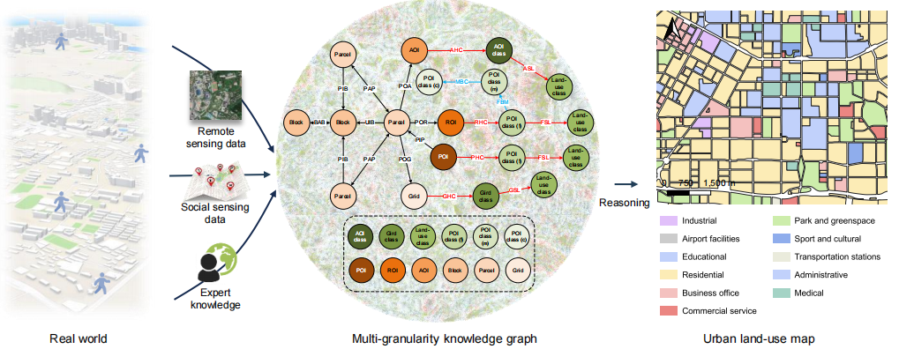
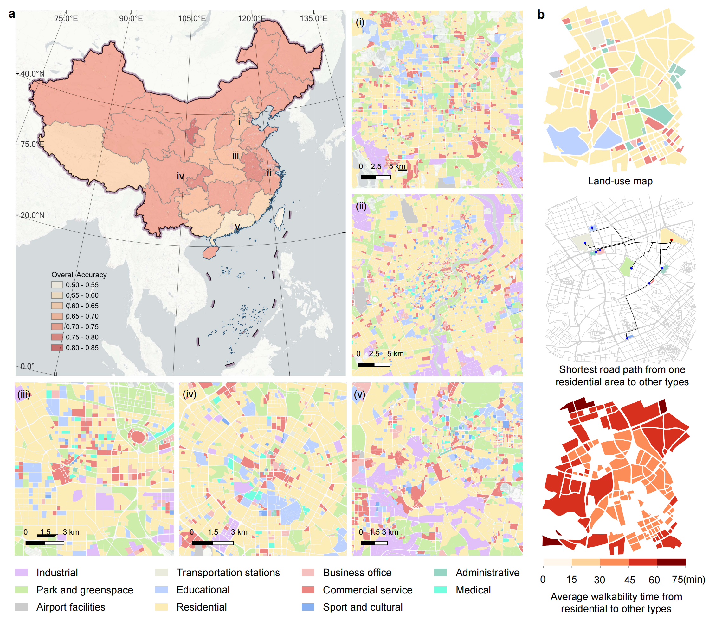

# mKGR

The official code of *Remote Sensing of Environment* paper **[Learning to Reason over Multi-Granularity Knowledge Graph for Zero-shot Urban Land-Use Mapping](https://www.sciencedirect.com/science/article/pii/S0034425725003657)**.

**Abstract:** This paper introduces a multi-granularity knowledge graph reasoning (mKGR) framework. Only with indirect supervision from other tasks, mKGR can automatically integrate multimodal geospatial data as varying granularity entities and rich spatial-semantic interaction relationships. Subsequently, mKGR incorporates a novel fault-tolerant knowledge graph embedding method to establish relationships between geographic units and land-use categories, thereby reasoning land-use mapping outcomes. Extensive experiments demonstrate that mKGR not only outperforms existing zero-shot approaches but also exceeds those with direct supervision. Furthermore, this paper reveals the superiority of mKGR in large-scale holistic reasoning, an essential aspect of land-use mapping. Benefiting from mKGR's zero-shot classification and large-scale holistic reasoning capabilities, a comprehensive urban land-use map of China is generated with low-cost.

- [x] Products: Publicly accessible on [ArcGIS Online](https://www.geosceneonline.cn/geoscene/apps/mapviewer/index.html?webmap=ad747de4b4ad4b558141c638e23960ca), download the products on [Zenodo](https://zenodo.org/records/20255618).
- [x] Code: Publicly available in this repository.
- [x] Dataset: Publicly available on [Zenodo](https://zenodo.org/records/20255618).
- [x] Data-processing pipeline: Fully open-sourced. The complete preprocessing (raw geospatial data → per-city shapefiles + seed labels) is in [KG_pre](./KG_pre/), with the nationwide reproduction data on [Zenodo](https://zenodo.org/records/20255618).

Ubuntu 20.04 (or other Linux distribution), one GPU (video memory greater than 12GB and support cuda)
* python>=3.11.5
* numpy>=1.26.2
* pytorch>=2.2.1
* pandas>=2.2.2
* geopandas>=0.14.0

## Pipeline

Three stages; the output of each is the input of the next. See each folder's README to run it.

| Stage | Folder | Role |
|---|---|---|
| 1 | [KG_pre](./KG_pre/) | raw geospatial data → per-city shapefiles + seed labels |
| 2 | [KG_construction](./KG_construction/) | shapefiles → MGKG triplets, id maps, train/valid/test/predict splits |
| 3 | [KG_embedding](./KG_embedding/) | train the fault-tolerant embedding, infer land-use, export result shapefiles |

Ready artifacts on [Zenodo](https://zenodo.org/records/20255618) — pick where to start:

- `KnowledgeGraph.zip` (5 cities) — the constructed MGKG; start at **stage 3**.
- `OriShapefile.zip` (5 cities) — per-city shapefiles; start at **stage 2**.
- `NationalKGpreReproduction.zip` (nationwide, 366 cities) — geometry layers to reproduce **stage 1**.
- `ChinaLandUse.gpkg` / `China15min.gpkg` — the final products.

## Other Code

 [figure_script](./figure_script/): The code for generating the figures in the paper.

 [landuse_app](./landuse_app/): The code for 15-minute city application of land-use mapping results.

We have published the land-use mapping and 15-minute walkability results of China on [ArcGIS Online](https://www.geosceneonline.cn/geoscene/apps/mapviewer/index.html?webmap=ad747de4b4ad4b558141c638e23960ca).
## Contact
If you have any questions about it, please let me know. (Create an 🐛 issue or 📧 email: wangfaye@whu.edu.cn)
