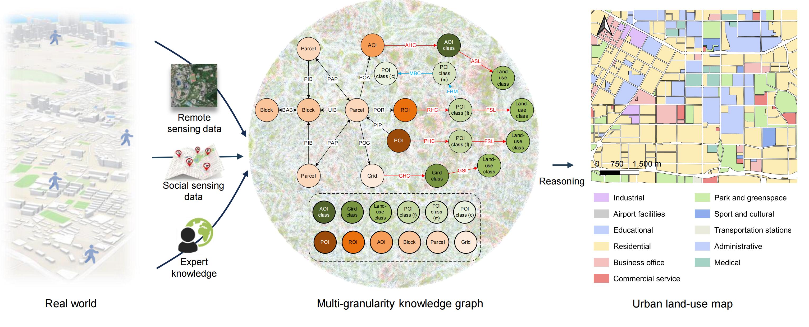

# mKGR

The official code of *Remote Sensing of Environment* paper **Learning to Reason over Multi-Granularity Knowledge Graph for Zero-shot Urban Land-Use Mapping**.

**Abstract:** This paper introduces a multi-granularity knowledge graph reasoning (mKGR) framework. Only with indirect supervision from other tasks, mKGR can automatically integrate multimodal geospatial data as varying granularity entities and rich spatial-semantic interaction relationships. Subsequently, mKGR incorporates a novel fault-tolerant knowledge graph embedding method to establish relationships between geographic units and land-use categories, thereby reasoning land-use mapping outcomes. Extensive experiments demonstrate that mKGR not only outperforms existing zero-shot approaches but also exceeds those with direct supervision. Furthermore, this paper reveals the superiority of mKGR in large-scale holistic reasoning, an essential aspect of land-use mapping. Benefiting from mKGR's zero-shot classification and large-scale holistic reasoning capabilities, a comprehensive urban land-use map of China is generated with low-cost.

- [x] Products: Publicly accessible on [ArcGIS Online](https://www.geosceneonline.cn/geoscene/apps/mapviewer/index.html?webmap=ad747de4b4ad4b558141c638e23960ca), download the products on [Zenodo](https://zenodo.org/records/11311869).
- [x] Code: Publicly available in this repository.
- [x] Dataset: Publicly available on [Zenodo](https://zenodo.org/records/11311869).
- [ ] Paper and Docs: The detailed operational documentation will be provided after the article is published.
## Requirement
Ubuntu 20.04 (or other Linux distribution), one GPU (video memory greater than 12GB and support cuda)
* python>=3.11.5
* numpy>=1.26.2
* pytorch>=2.2.1
* pandas>=2.2.2
* geopandas>=0.14.0

## MGKG Construction

Option 1: Directly download the [constructed graph](https://zenodo.org/records/11311869).

Option 2：Construct the graph in the [KG_construction](./KG_construction/) folder.

## MGKG Reasoning for Land-use Mapping

Train the graph embedding in the [KG_embedding](./KG_embedding/) folder and infer to obtain the land-use mapping result.

## Other Code

 [figure_script](./figure_script/): The code for generating the figures in the paper.

 [landuse_app](./landuse_app/): The code for 15-minute city application of land-use mapping results.

We have published the land-use mapping and 15-minute walkability results of China on [ArcGIS Online](https://www.geosceneonline.cn/geoscene/apps/mapviewer/index.html?webmap=ad747de4b4ad4b558141c638e23960ca).
## Contact
If you have any questions about it, please let me know. (Create an 🐛 issue or 📧 email: wangfaye@whu.edu.cn)
